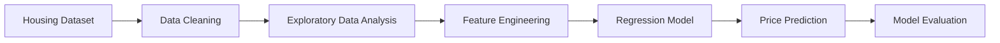

# 🏡 House Price Prediction

> **A machine learning regression project that predicts residential property prices using housing features, exploratory data analysis, and predictive modeling techniques.**

<p align="center">


</p>

---

# 📖 Overview

**House Price Prediction** is a supervised machine learning project that estimates residential property prices based on housing characteristics and market-related features.

The project demonstrates a complete machine learning workflow, including data preprocessing, exploratory data analysis (EDA), feature engineering, model training, evaluation, and prediction. It highlights how regression algorithms can be applied to real-world property valuation problems.

---

# 🎯 Objectives

* Predict house prices using machine learning.
* Explore relationships between housing features and property value.
* Demonstrate an end-to-end regression workflow.
* Evaluate model performance using standard regression metrics.

---

# ✨ Key Features

* 🏠 House price prediction
* 📊 Exploratory Data Analysis (EDA)
* 🧹 Data preprocessing
* 🔧 Feature engineering
* 🤖 Regression model training
* 📈 Model evaluation
* 📓 Jupyter Notebook implementation

---

# 🏗 Machine Learning Pipeline



---

# 🛠 Technology Stack

| Category             | Technology          |
| -------------------- | ------------------- |
| Programming Language | Python              |
| Machine Learning     | Scikit-learn        |
| Data Analysis        | Pandas              |
| Numerical Computing  | NumPy               |
| Visualization        | Matplotlib, Seaborn |
| Development          | Jupyter Notebook    |

---

# 📂 Project Structure

```text
house-price-prediction/

├── House_Price_Prediction.ipynb
├── dataset.csv
├── requirements.txt
└── README.md
```

> File names may vary depending on your project structure.

---

# 🚀 Installation

Clone the repository

```bash
git clone https://github.com/sajidrehman2/house-price-prediction.git
```

Navigate into the project

```bash
cd house-price-prediction
```

Install dependencies

```bash
pip install pandas numpy scikit-learn matplotlib seaborn notebook
```

Launch Jupyter Notebook

```bash
jupyter notebook
```

Run all notebook cells.

---

# 📊 Typical Features

Depending on the dataset, common housing attributes include:

* Number of bedrooms
* Number of bathrooms
* Living area
* Lot size
* Property age
* Garage capacity
* Neighborhood
* Overall quality
* Year built
* Location

---

# 🔄 Machine Learning Workflow

1. Load housing dataset
2. Clean missing values
3. Explore data visually
4. Engineer useful features
5. Train regression model
6. Evaluate performance
7. Predict house prices

---

# 📈 Applications

* Real estate analytics
* Property valuation
* Investment analysis
* Housing market research
* Educational machine learning projects

---

# 🚧 Future Improvements

* Compare multiple regression models
* Hyperparameter optimization
* Feature importance analysis
* Interactive Streamlit dashboard
* FastAPI prediction API
* Docker containerization
* Cloud deployment

---

# 🤝 Contributing

Contributions are welcome.

Feel free to fork the repository, improve the project, and submit pull requests.

---

# 👨‍💻 Author

**Sajid Rehman**

**AI & Data Science Engineer**

**Areas of Interest**

* Machine Learning
* Data Science
* Artificial Intelligence
* Predictive Analytics
* Python Development

GitHub: **https://github.com/sajidrehman2**

---

# ⭐ Support

If you found this project useful, consider giving it a **Star ⭐**. Your support helps others discover the project and encourages future improvements.
